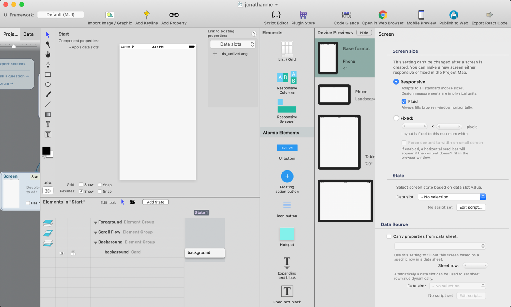
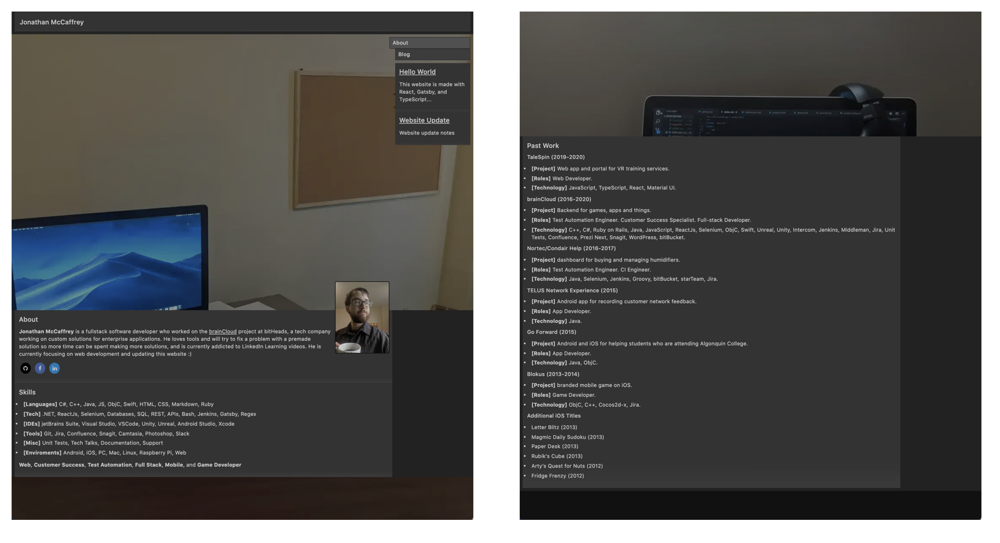
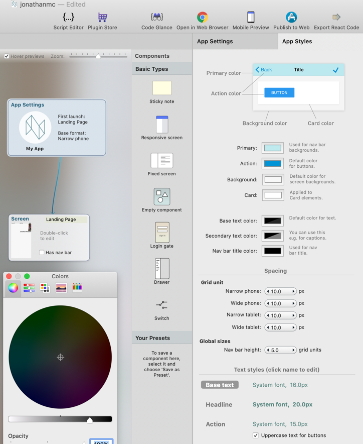
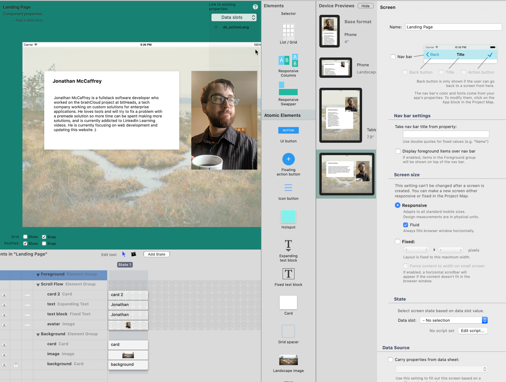
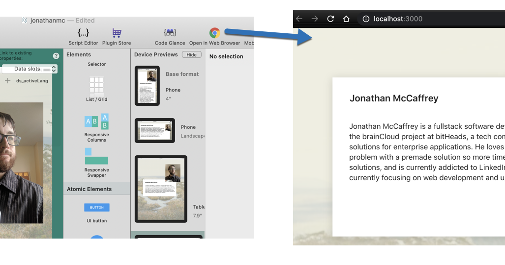

[React Studio](https://reactstudio.com/) is a design tool for a website, similar to what one would see in native development.

This website will be redesign using the tool, as mentioned on the [Website Update](https://jonathanmc.dev/blog/blog/2020-05-07-website-update/) page.

The first page to design in the tool will be: 
- the landing page.
- the roadmap.
- the document section.
- the resume page.

### The Landing Page

Currently, this page has a lot of redundant features with the Resume.

It should be simplified and streamlined, to basically state that I exist, and act as resource of links to the rest of the website.

My first item to attempt is changing the colour, via clicking on the App Settings panel, and visiting the App Styles tab. The System Colouring setting unfortunately seems to only work with a color picker. It's a bit cumbersome, and I don't see a method of changing the text colour either. Given this, I am going to leave it with the default colour scheme for now.

Creating a landing page, and dragging on the default UI elements seems simple enough; however, doing so also feels very wrong.

Nesting elements from this view doesn't appear intuitive. I am not sure how the scroll view works. I have disabled it for simplicity.

I am finding editing the UI a bit difficult. It looks like custom components will be the better flow when dealing with composing layouts.

Before continuing forward, I need to look at tutorials on using the React Studio UI.

A React Webinar Neonto Studio by  can be found [here](https://www.youtube.com/watch?v=Rfd7zmlFZw8).

At the [14:38](https://youtu.be/Rfd7zmlFZw8?t=878) of the Webinar, the video shows its one button click to deploy a test copy of the website, via the **[Open in Web Browser]** button. That's amazing.

Then document page.